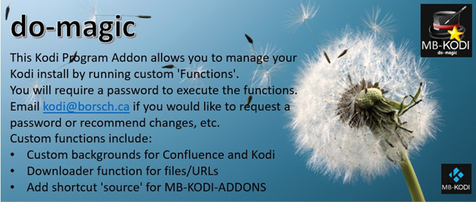
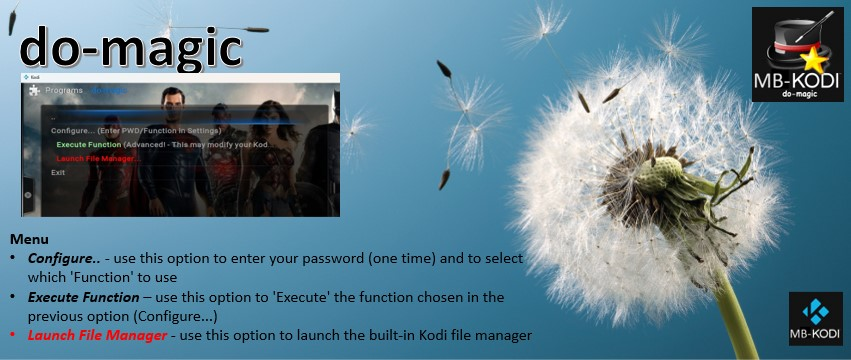
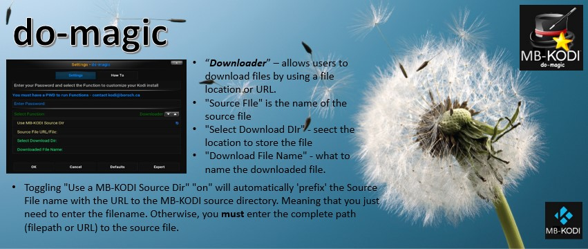
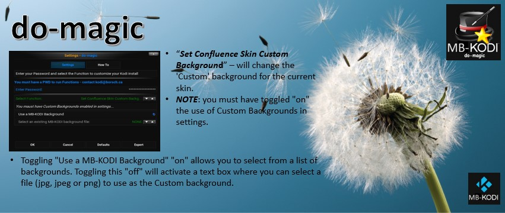
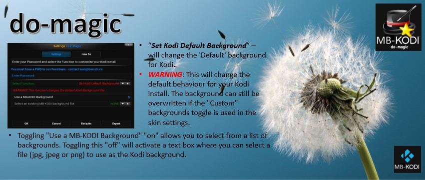
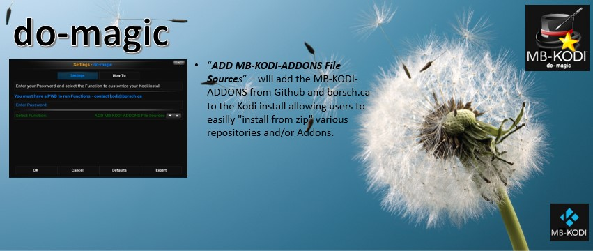
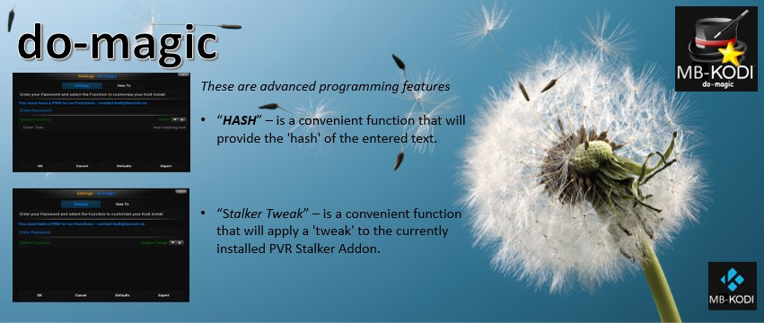

# plugin.program.do-magic
This Kodi Program Addon allows users to execute custom functions to modify their Kodi environment

 (  

# Program Addon: do-magic

This is a simple & lightweight KODI Program Addon that lets you quickly manage your Kodi install by allowing users to execute certain specialized functions to modify a Kodi environment.

> [!NOTE]
> (Latest) - This is the latest version of the do-magic Program Addon
> 
> Supported by MB-KODI ✔️

Latest Version do-magic :sunglasses:
- initial release
- Added ability for to select Functions to run
 - Set File Downloader, Backgrounds, file sources, HASH, Stalker Tweak
- Added Help screens
(Latest)

<a href="plugin.program.do-magic-1.0.zip">plugin.program.do-magic-1.0.zip</a> (Latest)

<B>RESTRICTED:</B> Contact MB-KODI (Latest)

This <B>do-magic</B> Program Addon is published as a Kodi Program Addon that you can install directly into Kodi. It is a private Addon only authorized for use for designated users and is supported by MB-KODI. 
 
<B>Installation Instructions</B> 
<B>1</B> - In Kodi use the "File Manager" to add a new 'source' pointing to the authorized source:  
<ul>
<li>NOTE: Contact MB-KODI for a password</li>
 <li>http://borsch.myqnapcloud.com:8089/do-magic</li>
 <li>https://m-borsch.github.io/do-magic</li>
</ul>
<B>2</B> - In Kodi use the "Addons" - "Install from zip" option to install the Addon utilizing the 'source' that you added in the previous step 

# How to use:

> [!WARNING] This is a 'restricted' Addon - meaning that you must have a password supplied by MB-KODI in order for the Addon to work.

> [!IMPORTANT]
> Depending on the settings you set in the configuration/setting panel, this Addon will either download files and/or set a Custom Skin Background or Kodi default background as well as allow users to easily 'HASH' a text string or Tweak a PVR Stalker install.

## ADDON Main Menu
> [!IMPORTANT]
> If you make a change to your Favourites list using "Manage Kodi Favourites" - make sure after you return to the main menu that you use one of the "Save" options to 'lock' in your change. Otherwise, your edits will be lost! 

### 1) Configure...   
Opens a dialog where you must enter your password. This is a one-time setup. You then select and configure the 'Function' that you want to Execute

### 2) Execute Function (Advanced! - This may modify your Kodi install)
THis is where you 'Execute' the function that you chose and configures in the previous menu item (Configure...).
   
### 3) File Manager
This launches the built-in Kodi File Manager.

### 4) Exit
Just steps back from the Addon.

## Help Screens Available in the Addon

### Overview:

### Menu:

### Function - Downloader:

### Function - Skin Custom Background:

### Function - Kodi Default Background:

### Function - Add MB-KODI-ADDONS File Source:

### Function - HASH / Stalker Tweak:

### Reference Articles available at: <a href="http://borsch.ca">borsch.ca</a>

- <a href="http://borsch.myqnapcloud.com:8083/index.php/articles-by-group/how-to/howto-create-a-github-kodi-addon?highlight=WyJrb2RpIl0="><b><i></i></b><i>Article on how to build a Kodi Repository and an Addon on borsch.ca</i></a>

Questions/Comments/thanks - <a href="mailto:kodi@borsch.ca">Send an email to MB-KODI</a> 

 No Copyright infringement intended  <a href="mailto:kodi@borsch.ca">Send an email to MB-KODI</a> to fix / Remove. (<em>NAS</em>)

> [!IMPORTANT]
> MB-KODI Terms and Conditions / Disclaimer

Information published on or related to MB-KODI® repository is accurate and correct to our knowledge, however, there may be omissions, errors, or mistakes. Content published on or related to MB-KODI is for informational purposes only. By continuing to use these services, you agree to the following Terms and Conditions. 

Terms and Conditions / Disclaimer

This disclaimer ("Disclaimer") is a legally binding agreement between you ("user," "visitor," "you" or "your") and this repository ("MB-KODI", "we," "our," or "us"). It sets forth the general guidelines, disclosures, and terms of your use of this repository ("repository", "addons", "plugins", "services," "products," "information," or "content") operated and/or offered by MB-KODI.

Please read this disclaimer carefully before continuing to use this repository. Do not access and use the repository if you do not agree to the terms of this disclaimer. By using this repository or its services, you acknowledge that you have thoroughly read and also understand the terms of this disclaimer and hereby agree to be bound thereof.

General Disclaimer

The information or content displayed on this website/repository/addon is the intellectual property of the owner of MB-KODI. You may not reuse, republish, or reprint such information or content without our consent.

All the information or content related to MB-KODI is published in good faith and solely for general information and educational purposes. They are not in any way intended to serve as a substitute for professional advice. Our website/repository/addon is provided on an "as is" basis, and the author makes no representations or warranties of any kind or in any form, whether express or implied, about the completeness, timeliness, reliability, availability, validity, suitability, and accuracy, or guarantee that there will be no losses, errors, and omissions with respect to the information, or content contained on this website/repository/addon. Any action taken in reliance on any such information or content provided is strictly at your own risk.

As a result, the owner, its partners, employees, or agents will not be held liable for any accruing loss or damage as a result of the use of, reliance on, and reference to our repository, including without limitation, any special or incidental, direct or indirect, and punitive, or consequential loss or damage whatsoever.

We make every effort to keep the repository running smoothly. However, we take no legal responsibility and will not be liable if the website, repository or any addons are unavailable or inaccessible due to technical malfunctions beyond our control.

External Links Disclaimer

Through our repository, you can follow links to visit external websites, repositories, addons or content originating from third-parties that are not in any way affiliated with MB-KODI. While we try to provide only quality links to relevant and ethical websites, we have no control over the nature, content, accuracy, adequacy, reliability, validity, and availability of these sites. Accordingly, the inclusion of such links to other websites, repositories, addons does not in any way imply a recommendation or endorsement for the services or products contained on those sites. Also, owners and content may change without notice and may occur before we have the opportunity to remove broken or harmful links.

Professional Disclaimer

MB-Kodi does not contain professional advice. This site's information and content are provided for general information and educational purposes only and are not substitutes for professional advice.

We recommend that you also consult with the appropriate professionals before taking any actions based on such information, as the use or reliance of any such information contained on this site is solely at your own risk.

Affiliates Disclaimer

MB-KODI may contain links to affiliate sites, and we may receive an affiliate commission for any purchases made by you on those sites using such affiliate links.

Please know that other sites may have different privacy policies and terms beyond our control when you leave our website/repository/addon. MB-KODI does not monitor or investigate any transaction between you and any such third-party. We recommend checking the Privacy Policies of these sites and their Terms and Conditions before uploading any content or engaging in any business or transaction.

Testimonial Disclaimer

MB-KODI may contain testimonials by users of services or products that reflect such users' experiences and opinions. However, such experiences, opinions, and thoughts are personal to such users and do not necessarily represent all other users of our services or products. Testimonials are displayed verbatim except in grammatical and typing errors and long and extraneous information. Please be aware that the views or opinions in such testimonials belong to the user and do not represent the views of MB-KODI. As a result, the testimonials should not be construed as representing the adequacy, reliability, validity, and availability of such services or products.

Changes and Amendments

We reserve the exclusive right to change or modify this policy and its terms at any given time by posting the updated version here. Notification of those changes will be promptly posted on this site should we update, amend, or modify this document. The continued use of this website and its services after any such changes shall be construed to be consent to such changes. However, we advise you to frequently visit this disclaimer to ensure that you are up-to-date with the latest changes.

Consent

By proceeding to use MB-KODI, you hereby acknowledge that you have read this disclaimer in its entirety and hereby consent to this disclaimer and agree to all of its terms. If you do not agree to be bound by the terms of this disclaimer, you are not permitted to continue to use or access MB-KODI and its services.

